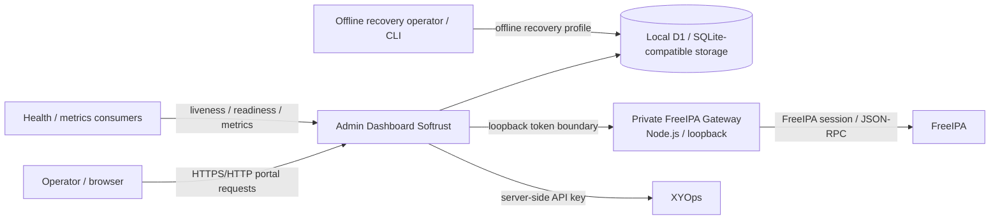

# Architecture

## Purpose

This document describes the **current runtime architecture** of Admin Dashboard Softrust. It is an orientation document, not a roadmap and not a replacement for domain runbooks.

For exact ownership of a contract, use [`SOURCE_OF_TRUTH.md`](SOURCE_OF_TRUTH.md). For repository placement, use [`PROJECT_STRUCTURE.md`](PROJECT_STRUCTURE.md). For operational procedures, use the corresponding active runbook.

## System context



### Ownership rule

- **Admin Dashboard Softrust** owns portal authentication, authorization, local configuration, local operational state, audit, approvals, portal-side run history and recovery metadata.
- **FreeIPA** owns directory identities and directory objects. A portal user is not a FreeIPA user merely because the names match.
- **XYOps** owns process definitions and execution semantics such as Events/Workflows, upstream jobs, scheduler/queue/concurrency and upstream rate limits. The portal does not become a second scheduler.

## Runtime topology

The current self-hosted deployment is Docker Compose based.

### Dashboard container

The dashboard runtime:

1. validates the production `CONFIG_ENCRYPTION_KEY` before starting the application runtime;
2. validates the configured identity mode and secure bootstrap requirements;
3. starts a private FreeIPA Gateway bound to `127.0.0.1` on an ephemeral or explicitly configured local port;
4. creates an ephemeral high-entropy gateway token and writes the Worker runtime environment to a mode-`0600` file under `/tmp`;
5. starts the Worker-oriented runtime through `scripts/run-portal-runtime.mjs`, which owns the exclusive runtime lock;
6. persists local runtime data under `.wrangler`, mounted from the Compose volume `dashboard-data`.

The current production image runs as the non-root `dashboard` user and exposes port `3001`. Docker liveness uses `GET /health/live`.

### Current runtime limitation

The production startup path currently launches Wrangler with `wrangler dev --local`. This is a **current implementation fact and known production-runtime limitation**, not a target architecture. Replacement of the development-oriented runtime is tracked separately by #51.

### Current network model

The current Compose service uses `network_mode: host`. This document records that fact only; the planned network hardening in #52 is not implemented merely because the issue exists.

### Recovery container

The Compose `recovery` profile uses a separate recovery image/entrypoint, runs as a non-root recovery user, mounts portal data explicitly, uses a read-only root filesystem plus `/tmp` tmpfs, and executes the offline recovery CLI. Detailed destructive recovery procedure belongs to [`OFFLINE_FULL_RESTORE.md`](OFFLINE_FULL_RESTORE.md).

## Server request architecture

### Actual entry chain

The built Worker entry is currently `worker/schema-migrations-entry.ts`. Request handling is composed through a series of wrapper/entry modules before the base `worker/index.ts` implementation.

The current chain is approximately:

```text
worker/schema-migrations-entry.ts
  -> maintenance-mode-root-entry.ts
  -> service-admin-root-entry.ts
  -> maintenance-control-root-entry.ts
  -> backup-selective-restore-root-entry.ts
  -> freeipa-group-member-entry.ts
  -> freeipa-user-bulk-entry.ts
  -> freeipa-user-query-entry.ts
  -> session-management-entry.ts
  -> diagnostics-entry.ts
  -> settings-revisions-entry.ts
  -> local-secure-entry.ts
  -> settings-input-normalizer-entry.ts
  -> settings-source-context-entry.ts
  -> settings-source-safe-entry.ts
  -> settings-source-entry.ts
  -> settings-lifecycle-entry.ts
  -> secure-entry.ts
  -> worker/index.ts
```

This wrapper chain is part of the **current architecture**, not the desired end state. Refactoring it into a clearer router/middleware/module structure is tracked by #56. Until that refactor is merged, documentation must not describe an idealized middleware stack as if it already exists.

### Request lifecycle

The exact gates depend on the route, but protected requests are evaluated through the current wrapper/handler chain using the following concerns:

1. request routing and correlation/error handling;
2. schema startup/boundary readiness;
3. identity resolution (anonymous, local session, or explicit service-administrator boundary where supported);
4. server-side role/permission checks;
5. same-origin and mutation safety checks where the route requires them;
6. maintenance/recovery restrictions for operations that are unsafe during maintenance or recovery;
7. bounded input normalization and domain validation;
8. domain handler or integration client;
9. audit/result persistence where the contract requires it;
10. sanitized response/error handling.

Do not infer authorization from UI visibility. The server-side route/handler boundary is authoritative.

## Identity and trust boundaries

### Anonymous browser

An unauthenticated browser has access only to intentionally public/recovery-safe surfaces such as the supported health endpoints and the login flow. It does not receive implicit administrative capability.

### Local portal user/session

The supported production identity mode is local portal authentication. Portal users and sessions live in the local database. Built-in roles currently include `viewer`, `operator` and `admin`; effective permissions are enforced server-side.

Portal identities are separate from FreeIPA identities and groups unless a future explicitly implemented mapping says otherwise.

### Service-administrator boundary

Some narrowly scoped administrative/recovery endpoints support the explicit service-administrator token boundary (`ADMIN_TOKEN` / `x-admin-token`). This mechanism is not a general browser session and must not be treated as a universal bypass of schema, maintenance, recovery or route-specific authorization rules.

### FreeIPA credentials and session material

FreeIPA credentials are server-side integration configuration. The private Node.js Gateway establishes/uses the upstream FreeIPA session and does not expose upstream cookies or credentials to the browser. Worker-to-Gateway communication uses an ephemeral loopback token generated at startup.

### XYOps API key

The XYOps API key is server-side only. The portal may expose normalized catalog/run state to the UI, but not the API key or arbitrary raw upstream responses.

### Recovery/controller secrets

Maintenance controller secrets, restore-stage secrets, backup encryption material and recovery secrets belong to their specific guarded workflows. Status APIs return only the bounded evidence defined by those contracts; they are not secret-recovery endpoints.

## Data ownership

The local D1/SQLite-compatible database contains portal-owned state. The canonical schema and migration lifecycle are owned by `db/portal-schema.ts` and the versioned migration registry/runtime described in [`DATABASE_MIGRATIONS.md`](DATABASE_MIGRATIONS.md).

| Domain | Local persistence / owner | External owner where applicable |
| --- | --- | --- |
| Portal users and sessions | `portal_users`, `portal_sessions` | Portal |
| Effective settings and lifecycle | `app_settings`, settings drafts/revisions/apply/reset/source-lock tables | Portal; secret integration values are encrypted server-side |
| Catalog snapshots/history/sync state | XYOps catalog snapshot/history/sync tables | XYOps owns the upstream process definitions |
| Automation routes/presentation/visibility policies | local route/policy/presentation state | Portal presentation/access layer; does not replace XYOps process ownership |
| Operation runs/results/replay/notifications | operation/run result/replay/notification tables | Portal records normalized history; XYOps owns upstream job execution |
| Approvals | approval policy/set/request/decision tables | Portal approval gate before allowed execution |
| Audit | `portal_audit_events` and append-only protections | Portal |
| Schema lifecycle | `portal_schema_migrations`, schema lock | Portal canonical schema/migration runtime |
| Maintenance | `portal_maintenance_state` | Portal |
| Restore staging/recovery metadata | restore-stage and migration-operation tables plus bounded recovery receipts | Portal recovery workflows |
| FreeIPA users/groups | not authoritative local directory storage | FreeIPA |

Large machine-readable schema inventories should not be duplicated here. Use the canonical schema/migration owner and tests.

## Integration boundaries

### FreeIPA

The portal uses a private Node.js Gateway (`scripts/freeipa-gateway.mjs`) for allowed FreeIPA operations. The Gateway exists because FreeIPA authentication/session behavior belongs on the server side and requires a controlled boundary around credentials, cookies, TLS and JSON-RPC error normalization.

FreeIPA CRUD/query behavior should be extended through the existing integration/Gateway ownership rather than by creating browser-side FreeIPA clients.

### XYOps

The portal accesses XYOps server-side for catalog and execution functions. It normalizes process metadata for portal presentation and stores portal-side operation state, but execution scheduling and upstream job semantics remain XYOps-owned. See [`XYOPS_EXECUTION_OWNERSHIP.md`](XYOPS_EXECUTION_OWNERSHIP.md).

## Frontend architecture

The frontend uses the `app/` tree with React/Vinext. `app/layout.tsx` owns the document layout and mounts several global portal interaction/enhancement components. The main product UI is still heavily concentrated in `app/page.tsx`, with additional dedicated pages such as login, access, sessions and diagnostics plus feature-specific CSS layers.

A shared UI foundation is part of current `main`: semantic design tokens live under `app/styles/`, and domain-agnostic primitives are exported from `app/ui/`. In addition, #113 merged a reusable product shell/navigation foundation under `app/shell/`: `AppShell.tsx`, the typed grouped product-navigation model in `navigation.ts`, local typed SVG icons and shell styles are current code and should be reused instead of creating a parallel global navigation model.

The `app/shell/` foundation is **not yet the primary Home composition**. PR #113 intentionally left `app/page.tsx` untouched because it remains a large shared high-conflict surface. Targeted Home/AppShell wiring remains follow-up work under #94. Therefore current-state code owns a reusable AppShell/navigation foundation, while the rendered primary product composition is still the existing `app/page.tsx` implementation until that integration lands.

The concentration in `app/page.tsx` remains a current maintainability constraint. Broader UI architecture work under #92–#94 must be described according to what is actually merged; #113 is current foundation, while unfinished Home integration remains planned/in-progress.

Frontend code must not become a second authorization layer: UI visibility improves UX, while permissions remain enforced by server-side contracts.

## Schema and startup boundary

Canonical schema verification/migration runs before ordinary application traffic through `worker/schema-migrations-entry.ts` and the database migration runtime.

Key rules are defined in [`DATABASE_MIGRATIONS.md`](DATABASE_MIGRATIONS.md):

- released migration definitions/checksums are immutable;
- automatic migrations may be applied at startup according to the registry;
- controlled migration suffixes are not silently applied as ordinary startup work;
- incompatible drift blocks the supported runtime path;
- migration/adoption uses a persistent journal and lock.

## Health and failure boundaries

Health contracts intentionally distinguish different failure classes:

- **liveness** — the process can answer HTTP; it is the Docker restart signal;
- **readiness** — required local runtime dependencies are ready to serve work;
- **dependency health** — read-only external FreeIPA/XYOps state; degradation does not automatically mean the portal process should restart;
- **metrics** — low-cardinality monitoring projection that does not run external dependency probes.

See [`HEALTH_CONTRACTS.md`](HEALTH_CONTRACTS.md) and [`HEALTH_METRICS.md`](HEALTH_METRICS.md).

## Maintenance, backup and recovery

The project has intentionally separate recovery levels:

- normal backup/export and read-only preview;
- isolated test restore;
- selective production restore under the required guarded workflow;
- persistent maintenance mode;
- destructive **offline** full restore with recovery point, candidate verification, atomic SQLite swap/rollback and receipt evidence.

These workflows have different security and availability assumptions. Do not collapse them into one generic “restore” endpoint or copy destructive commands into overview documentation.

Authoritative runbooks:

- [`MAINTENANCE_MODE.md`](MAINTENANCE_MODE.md)
- [`OFFLINE_FULL_RESTORE.md`](OFFLINE_FULL_RESTORE.md)

## Storage diagnostics and migration operations

Storage status, integrity inspection and migration preflight/apply expose bounded administrative contracts rather than arbitrary SQL. The portal does not provide a SQL console or automatic destructive repair surface.

Use:

- [`STORAGE_STATUS.md`](STORAGE_STATUS.md)
- [`STORAGE_INTEGRITY.md`](STORAGE_INTEGRITY.md)
- [`DATABASE_MIGRATIONS.md`](DATABASE_MIGRATIONS.md)

## Current architectural constraints

These are current-state constraints, not recommendations:

1. **Large Worker wrapper chain and base entrypoint.** Request concerns are spread across many wrapper entries plus `worker/index.ts`; #56 tracks refactoring.
2. **Frontend concentration despite reusable shell foundation.** Shared tokens/primitives exist in `app/styles/` and `app/ui/`, and `app/shell/` now owns a merged AppShell/navigation foundation, but the primary Home composition remains concentrated in `app/page.tsx` until #94 integration work lands.
3. **Local SQLite/D1-compatible ownership.** The supported deployment persists one local `.wrangler` data directory through a Compose volume. No active current-state document establishes a horizontally scaled multi-writer database architecture.
4. **Development-oriented Wrangler production command.** Production currently uses `wrangler dev --local`; #51 tracks replacement.
5. **Host networking.** Current Compose uses `network_mode: host`; #52 tracks a different network model.
6. **Distributed route/reference ownership.** A single declarative API/permission registry does not yet exist; until it does, route contracts must be verified against current handlers/wrappers/tests plus owner documents.

## How to use this document

Use this file to understand system shape and boundaries. Then follow the canonical owner:

- repository placement: [`PROJECT_STRUCTURE.md`](PROJECT_STRUCTURE.md);
- owner registry: [`SOURCE_OF_TRUTH.md`](SOURCE_OF_TRUTH.md);
- terminology: [`GLOSSARY.md`](GLOSSARY.md);
- AI-agent rules: [`ai/README.md`](ai/README.md);
- operational details: the relevant active runbook.

If this document and current runtime disagree, treat that as a documentation defect and verify the current `main` plus the canonical owner before changing behavior.
