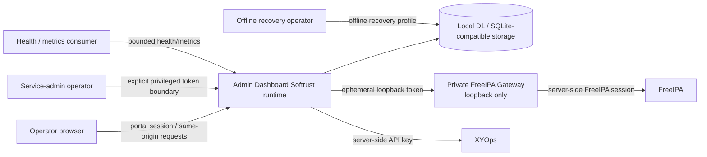

# Security model

## Purpose

This document describes the **current security model** of Admin Dashboard Softrust. It is an orientation document for developers, operators, security reviewers and AI agents. It does not replace exact security/reference documents or destructive-operation runbooks.

For exact contract ownership, use [`SOURCE_OF_TRUTH.md`](SOURCE_OF_TRUTH.md). For runtime topology and module placement, use [`ARCHITECTURE.md`](ARCHITECTURE.md) and [`PROJECT_STRUCTURE.md`](PROJECT_STRUCTURE.md). For exact operational procedures, use the relevant active runbook.

## Security objectives

The current design protects the following assets and boundaries:

- administrative access to the portal;
- portal user credentials and session material;
- FreeIPA integration credentials and upstream session cookies;
- the XYOps API key and upstream execution boundary;
- encrypted local integration/configuration values;
- local authorization, approval and mutation boundaries;
- append-only audit evidence and redaction guarantees;
- backup encryption material and restore/recovery controller secrets;
- local schema/storage integrity and recovery sequencing.

The portal is not designed as a browser-side credential broker. Upstream administrative credentials stay on the server side.

## Trust-boundary overview

The key trust boundaries are:

1. **Browser ↔ Portal** — browser requests are untrusted input; authentication and authorization remain server-side.
2. **Portal ↔ Local storage** — local portal state is authoritative for portal identities, sessions, approvals, audit, settings lifecycle and recovery metadata.
3. **Portal ↔ FreeIPA Gateway** — FreeIPA credentials/cookies do not cross into the browser; Worker-to-Gateway calls use a private loopback boundary and startup-generated token.
4. **Portal ↔ XYOps** — the API key is server-side; the portal consumes/normalizes upstream process state but does not become the scheduler owner.
5. **Normal runtime ↔ privileged recovery** — service-admin, maintenance, restore-stage and offline recovery credentials are purpose-specific boundaries, not a general bypass mechanism.

## Identity model

### Anonymous

Anonymous callers are limited to intentionally public/recovery-safe surfaces such as supported health endpoints and the login flow. Anonymous access does not imply any administrative capability.

### Local portal user

The supported production identity mode is local portal authentication. Portal users are stored in the local database and authenticate into portal sessions.

Built-in roles include:

- `viewer`;
- `operator`;
- `admin`.

Exact permission mappings and session behavior belong to [`LOCAL_AUTH_RBAC.md`](LOCAL_AUTH_RBAC.md) and the current server-side authorization implementation.

### Portal identity is not FreeIPA identity

A portal user and a FreeIPA directory user are separate security principals even if their usernames happen to match.

Portal authentication grants access to the portal according to portal RBAC. FreeIPA credentials used by the integration belong to the server-side integration boundary. No implicit identity federation or authorization mapping should be inferred unless an explicit current implementation and contract exists.

### Service-administrator boundary

Some narrowly scoped administrative/recovery endpoints support an explicit service-administrator token boundary using `ADMIN_TOKEN` / `x-admin-token`.

This boundary:

- is not a normal browser login;
- is not a universal administrator session;
- does not automatically bypass schema, maintenance, recovery or route-specific safety gates;
- must remain limited to the exact handlers that intentionally support it.

Adding a new route to this boundary is a privileged-contract change and requires explicit tests and documentation.

### FreeIPA integration identity

FreeIPA access is performed server-side. The private Node.js Gateway owns the upstream login/session mechanics and upstream cookie material.

The browser must never receive FreeIPA passwords, upstream cookies or the private Worker-to-Gateway token.

### XYOps integration identity

XYOps access uses a server-side API credential. The browser may receive normalized catalog/run data that the portal intentionally exposes, but it must not receive the API key or arbitrary raw upstream response material.

### Recovery/controller identities

Maintenance controller secrets, restore-stage secrets, backup encryption material and offline recovery credentials belong to their specific workflows. They must not be generalized into a second application authentication system.

## Authentication and session security

The current production default is local authentication. Startup validates identity/deployment policy before the supported runtime proceeds.

The current local-auth contract includes:

- password hashing rather than plaintext password storage;
- bounded failed-login handling and temporary account lockout;
- opaque session tokens;
- storage of session-token hashes rather than reusable raw session tokens in the database;
- explicit session expiry/revocation semantics;
- HttpOnly cookie-based browser session handling;
- secure bootstrap/startup policy for supported production identity mode.

Exact algorithms, timing values and endpoint semantics belong to [`LOCAL_AUTH_RBAC.md`](LOCAL_AUTH_RBAC.md) and current tests. Do not copy those constants into additional documents unless a second normative copy is required.

## Authorization and mutation protection

### Server-side authorization is authoritative

UI visibility is not an authorization mechanism.

Hiding, disabling or visually de-emphasizing an action improves UX, but privileged operations must still be denied by the server when the caller lacks the required permission or security context.

### Mutation safety

Protected mutations are subject to the current route-specific security chain, which may include:

- authenticated identity/session resolution;
- server-side role/permission checks;
- same-origin and mutation-safety checks where implemented;
- bounded input normalization/validation;
- approval requirements where the operation contract requires them;
- maintenance/recovery/schema restrictions;
- audit/result persistence and redacted error handling.

Do not assume every route has identical gates. The handler/wrapper/test ownership for that route is authoritative.

### Confirmations are not authorization

Destructive confirmation UI, typed confirmation phrases and similar interaction protections reduce accidental user error. They do **not** grant permission and must not replace server-side authorization, approvals or maintenance/recovery restrictions.

## Secret ownership and handling

| Secret / sensitive material | Current owner / location | Must not appear in | Current handling boundary |
| --- | --- | --- | --- |
| `CONFIG_ENCRYPTION_KEY` | deployment/runtime environment | repository, committed Compose defaults, browser, logs | external production secret; startup validates it; used for protected local configuration data |
| `ADMIN_TOKEN` | deployment/operator boundary | browser storage, ordinary portal session, logs/docs fixtures | explicit service-admin token for supported privileged routes only |
| Portal passwords | local-auth input / password verifier state | logs, audit payloads, browser persistence beyond form handling | hashed verifier semantics; never stored as plaintext application data |
| Portal session token | HttpOnly browser session / runtime | database as reusable raw token, logs | opaque token; database stores token hash according to local-auth contract |
| FreeIPA username/password | server-side integration configuration | browser, UI payloads, logs/audit | server-side only; used by private Gateway/upstream session flow |
| FreeIPA cookies/session material | private Gateway memory/session flow | Worker response to browser, logs | retained inside the server-side integration boundary |
| Worker ↔ FreeIPA Gateway token | generated at startup, loopback runtime boundary | persistent config, browser, repository | high-entropy ephemeral token used for private local Gateway calls |
| XYOps API key | server-side integration configuration | browser, logs, arbitrary diagnostics | server-side client only; normalized downstream data may be exposed separately |
| Backup encryption material | backup/recovery workflow | ordinary API payloads, logs, audit | purpose-specific encryption/decryption boundary |
| Maintenance/restore/recovery controller secrets | guarded maintenance/recovery workflows | normal browser state, generic admin API, logs | purpose-specific state transition/recovery authorization |

For exact production encryption-key requirements use [`CONFIG_ENCRYPTION_KEY.md`](CONFIG_ENCRYPTION_KEY.md).

## Integration isolation

### FreeIPA

The private FreeIPA Gateway is a trust boundary, not just a convenience proxy.

It exists so that:

- FreeIPA credentials remain server-side;
- upstream login/session cookies remain server-side;
- TLS and JSON-RPC behavior can be normalized at one integration boundary;
- browser code cannot directly turn portal access into arbitrary FreeIPA credential use.

New FreeIPA features should extend the existing server-side integration owner instead of adding a browser-side FreeIPA client.

### XYOps

XYOps process/catalog/run integration is also server-side. The portal may impose its own presentation, portal permissions, approvals and local audit/history, but it must not leak the API credential or silently redefine XYOps scheduler/concurrency ownership.

See [`XYOPS_EXECUTION_OWNERSHIP.md`](XYOPS_EXECUTION_OWNERSHIP.md).

## Local data protection

### Encrypted settings

Sensitive integration/configuration values stored by the portal use the configured application encryption boundary. Production startup requires a valid external `CONFIG_ENCRYPTION_KEY`.

Encryption-at-rest does not make secret values safe to return through API responses or diagnostics. Read/status endpoints should expose only the bounded metadata required by their contract.

### Redaction

Credentials, session tokens, encryption keys, controller/recovery secrets and sensitive upstream material must be removed or transformed before logging, diagnostics, audit or error responses.

When adding a new privileged/sensitive field, redaction is part of the feature contract rather than optional cleanup.

## Audit security

The portal maintains an append-only audit model for supported audited actions. Audit records are intended to preserve security-relevant evidence such as action, actor context, correlation and bounded result metadata without becoming a secret dump.

Security rules:

- do not log credentials or raw secret values;
- preserve correlation/evidence needed for review;
- treat audit-read authorization separately from normal UI visibility;
- do not weaken append-only or redaction behavior to simplify tests or debugging.

Exact fields/read API/permissions belong to [`AUDIT_LOG.md`](AUDIT_LOG.md).

## Approval boundary

Where an operation contract requires approval, approval is an additional policy gate before execution. It does not replace authentication/RBAC and it does not grant broader administrative identity outside the approved operation context.

A new privileged workflow must not bypass the existing approval owner merely because the upstream FreeIPA/XYOps call could technically be made directly.

## Maintenance and recovery security

The project deliberately separates different operational privilege levels.

### Normal operation

Ordinary authenticated/admin APIs operate under the normal session/RBAC/route safety model.

### Maintenance mode

Persistent maintenance state restricts normal application work while controlled recovery/storage operations are performed. Maintenance is a fail-closed operational boundary, not only a UI banner.

Use [`MAINTENANCE_MODE.md`](MAINTENANCE_MODE.md) for exact state transitions and controller semantics.

### Selective restore

Selective restore uses its dedicated staged/guarded contract. It must not be collapsed into a generic unrestricted data-write API.

### Offline full restore

Destructive full restore is intentionally an **offline** recovery workflow with different availability and filesystem privileges from the normal application runtime.

The supported procedure includes guarded preflight/recovery-point/candidate verification/atomic swap/verification/rollback semantics. Those operational commands belong only in [`OFFLINE_FULL_RESTORE.md`](OFFLINE_FULL_RESTORE.md).

Offline recovery capability must never be exposed as an ordinary online browser/API bypass merely for convenience.

## Schema and storage security boundary

The supported runtime verifies/migrates the local schema through the canonical schema lifecycle before ordinary application work.

Security-relevant properties include:

- immutable released migration definitions/checksums;
- persistent migration journal/lock semantics;
- drift/incompatibility detection;
- controlled handling of migration classes that are not safe to silently apply at ordinary startup;
- bounded storage/integrity diagnostics instead of arbitrary SQL execution.

An incompatible schema/storage state may intentionally block supported runtime work rather than continuing with unknown semantics.

See [`DATABASE_MIGRATIONS.md`](DATABASE_MIGRATIONS.md), [`STORAGE_STATUS.md`](STORAGE_STATUS.md) and [`STORAGE_INTEGRITY.md`](STORAGE_INTEGRITY.md).

## Fail-closed versus degraded behavior

Different failure classes intentionally have different outcomes.

### Fail closed / block supported work

Examples of boundaries that are intended to prevent ordinary supported startup or privileged work when invalid include:

- invalid/missing production encryption-key configuration;
- unsupported/invalid identity startup policy;
- incompatible canonical schema drift or unsafe migration state;
- maintenance/recovery state where a normal operation is not allowed;
- failed route-specific authentication/permission/approval requirements.

### Degraded but observable

External dependency failures such as FreeIPA or XYOps unavailability are represented through bounded dependency-health/diagnostic state where appropriate. They should not automatically be interpreted as proof that the portal process itself must restart.

Liveness, readiness, dependency health and metrics are intentionally separate contracts. See [`HEALTH_CONTRACTS.md`](HEALTH_CONTRACTS.md) and [`HEALTH_METRICS.md`](HEALTH_METRICS.md).

## Diagnostics and information disclosure

Health/storage/diagnostic endpoints must expose only the information needed by their explicit contract.

They must not become a way to retrieve:

- passwords or API keys;
- raw session tokens/cookies;
- encryption/controller/recovery secrets;
- arbitrary database rows;
- unrestricted upstream responses;
- sensitive internal error dumps.

Operational evidence should be bounded, redacted and stable enough for monitoring/recovery decisions.

## Security invariants for contributors and AI agents

The following rules are mandatory unless an explicit architectural/security decision replaces them:

1. **Never move authorization to UI only.** Server-side enforcement remains authoritative.
2. **Never expose upstream credentials/session material to the browser.** FreeIPA and XYOps credentials stay server-side.
3. **Never create a generic admin bypass.** `ADMIN_TOKEN`, maintenance and recovery credentials remain purpose-specific.
4. **Never weaken fail-closed schema/maintenance/recovery gates just to make a test pass.** Fix the contract or the implementation deliberately.
5. **Never log raw secrets.** Redaction is part of the security contract.
6. **Never create a second auth/session/RBAC owner.** Extend the existing canonical owner.
7. **Never treat destructive confirmation as permission.** UX safety and authorization are separate layers.
8. **Do not infer implemented security from an Issue or plan.** Verify current code/tests/ref.
9. **A new privileged boundary requires tests and documentation.** If it changes architecture/trust ownership, add an ADR when the ADR framework exists.
10. **Preserve rollback/recovery evidence.** Security-critical recovery changes must keep explicit verification and failure semantics.

## Current limitations and hardening roadmap

The following are known current-state limitations or open hardening work. They are **not implemented controls merely because an Issue exists**:

- current Compose networking uses host networking; replacement/hardening is tracked by #52;
- reverse-proxy/TLS/security-header hardening is tracked by #53;
- backend request composition remains a large wrapper chain; refactoring is tracked by #56 and must preserve existing security gates;
- route/permission/reference ownership is still distributed rather than generated from one canonical declarative API registry.

The canonical production runtime now uses the Node startup path introduced by #51/#194; Wrangler development mode is no longer a current production limitation.

Always inspect current `main` before repeating this list in another document; merged hardening work should be removed from this section when it stops being a limitation.

## Related security documents

- [`ARCHITECTURE.md`](ARCHITECTURE.md) — system topology and trust-boundary context;
- [`PROJECT_STRUCTURE.md`](PROJECT_STRUCTURE.md) — module/owner placement;
- [`LOCAL_AUTH_RBAC.md`](LOCAL_AUTH_RBAC.md) — exact portal authentication, sessions, roles and permissions;
- [`AUDIT_LOG.md`](AUDIT_LOG.md) — audit contract/redaction/read boundary;
- [`CONFIG_ENCRYPTION_KEY.md`](CONFIG_ENCRYPTION_KEY.md) — production encryption-key requirements;
- [`DATABASE_MIGRATIONS.md`](DATABASE_MIGRATIONS.md) — schema/migration fail-closed lifecycle;
- [`MAINTENANCE_MODE.md`](MAINTENANCE_MODE.md) — persistent maintenance boundary;
- [`OFFLINE_FULL_RESTORE.md`](OFFLINE_FULL_RESTORE.md) — destructive offline recovery procedure;
- [`HEALTH_CONTRACTS.md`](HEALTH_CONTRACTS.md) — liveness/readiness/dependency semantics;
- [`STORAGE_STATUS.md`](STORAGE_STATUS.md) and [`STORAGE_INTEGRITY.md`](STORAGE_INTEGRITY.md) — bounded storage diagnostics;
- [`XYOPS_EXECUTION_OWNERSHIP.md`](XYOPS_EXECUTION_OWNERSHIP.md) — portal/XYOps responsibility boundary.

If this overview disagrees with current runtime or an exact active owner document, treat the mismatch as a documentation defect. Verify the current code/tests and canonical owner before changing behavior.
