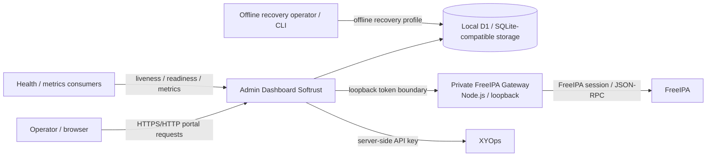

# Architecture

## Purpose

This document describes the **current runtime architecture** of Admin Dashboard Softrust. It is an orientation document, not a roadmap and not a replacement for domain runbooks.

For exact ownership of a contract, use [`SOURCE_OF_TRUTH.md`](../reference/SOURCE_OF_TRUTH.md). For repository placement, use [`PROJECT_STRUCTURE.md`](PROJECT_STRUCTURE.md). For operational procedures, use the corresponding active runbook.

## System context



### Ownership rule

- **Admin Dashboard Softrust** owns portal authentication, authorization, local configuration, local operational state, audit, approvals, portal-side run history and recovery metadata.
- **FreeIPA** owns directory identities and directory objects. A portal user is not a FreeIPA user merely because the names match.
- **XYOps** owns process definitions and execution semantics such as Events/Workflows, upstream jobs, scheduler/queue/concurrency and upstream rate limits. The portal does not become a second scheduler.

## Runtime topology

The current self-hosted deployment is Docker Compose based.

### Dashboard container

The production image runs as the non-root `dashboard` user, exposes port `3001`, and starts the canonical Node production entrypoint:

```text
node --experimental-strip-types scripts/start-production.mjs
```

The startup path is owned by `scripts/start-production.mjs` and `runtime/production-runtime.mjs`. At a high level it:

1. builds the production runtime options from the process environment;
2. loads the built Worker artifact, defaulting to `dist/server/index.js`;
3. starts the private FreeIPA Gateway on `127.0.0.1` using an ephemeral high-entropy token;
4. creates the runtime application and SQLite-backed D1-compatible database boundary;
5. applies canonical schema verification/migrations before ordinary application service becomes ready;
6. starts the Node Worker HTTP host for the built Worker artifact and static assets;
7. starts the portal scheduler only through the canonical runtime orchestration;
8. installs coordinated `SIGTERM`/`SIGINT` shutdown handling with a bounded shutdown timeout.

The canonical production startup no longer uses `wrangler dev --local`. Wrangler/Vinext remain development/build tooling where configured, but they are not the production process owner after the #51/#194 runtime cutover.

Docker liveness uses `GET /health/live`.

### Persistence boundary

The canonical production image declares `PORTAL_DATA_DIR=/data`, and the Node SQLite persistence boundary owns the production database path under that persistence root unless explicitly configured otherwise.

Current `compose.yaml` mounts the `dashboard-data` named volume at `/data` for the dashboard service. The recovery profile mounts the same named volume at `/portal-data`. The container paths differ, but both profiles address the same persistent volume; this is the current Compose persistence contract.

### Current network model

The current Compose service uses `network_mode: host`. This document records that fact only; the planned network hardening in #52 is not implemented merely because the issue exists.

### Recovery container

The Compose `recovery` profile uses a separate recovery image/entrypoint, runs as a non-root recovery user, mounts the shared `dashboard-data` volume at `/portal-data`, uses a read-only root filesystem plus `/tmp` tmpfs, and executes the offline recovery CLI. Production and recovery therefore address the same named persistent volume through profile-specific container paths.

Detailed destructive recovery procedure belongs to [`OFFLINE_FULL_RESTORE.md`](../OFFLINE_FULL_RESTORE.md).

## Server request architecture

### Actual Worker entry chain

The built Worker entry is currently `worker/schema-migrations-entry.ts`. It owns pre-application infrastructure handling and normal schema readiness, while the bounded storage administration paths are intentionally delegated through before the ordinary schema-ready gate so recovery/inspection can still operate. Downstream traffic enters the explicit `worker/application.ts` composition boundary. `worker/application-router.ts` classifies requests using canonical route metadata, then all classifications enter `worker/security-composition.ts`.

`security-composition.ts` now owns the first extracted security gate: controlled storage migration apply/status/reconcile is evaluated by `worker/middleware/storage-migration-apply.ts` and the existing `worker/storage-migration-apply-entry.ts` before maintenance. Any handled migration response short-circuits there. All other traffic is delegated unchanged into the remaining compatibility wrapper graph.

The current chain is approximately:

```text
worker/schema-migrations-entry.ts
  -> application.ts
  -> application-router.ts
       -> canonical match/classification
       -> security composition dispatch
  -> security-composition.ts
       -> middleware/storage-migration-apply.ts
          -> storage-migration-apply-entry.ts (exact controlled migration paths only)
       -> compatibility dispatch for all remaining traffic
  -> maintenance-mode-root-entry.ts
  -> service-admin-root-entry.ts
  -> maintenance-control-root-entry.ts
  -> backup-selective-restore-root-entry.ts
  -> freeipa-group-member-entry.ts
  -> freeipa-user-bulk-entry.ts
  -> freeipa-user-query-entry.ts
  -> session-management-entry.ts
  -> diagnostics-entry.ts
  -> settings-revisions-entry.ts
  -> local-secure-entry.ts
  -> settings-input-normalizer-entry.ts
  -> settings-source-context-entry.ts
  -> settings-source-safe-entry.ts
  -> settings-source-entry.ts
  -> settings-lifecycle-entry.ts
  -> secure-entry.ts
  -> worker/index.ts
```

The explicit application/router/security-composition boundary is part of the **current application request architecture**. Storage migration apply/status/reconcile is the first security decision boundary extracted from the historical wrapper chain; maintenance, service-admin, local-session, authorization, handler selection and most audit/error behavior remain compatibility-owned while #56 incrementally replaces them with explicit composition backed by parity tests.

### Request lifecycle

The exact gates depend on the route. Current protected request processing uses these ordered concerns where applicable:

1. pre-application infrastructure handling and either normal schema readiness or an explicitly allowlisted storage/recovery pass-through in `schema-migrations-entry.ts`;
2. canonical application route classification;
3. explicit controlled storage migration apply/status/reconcile gate for those exact paths;
4. maintenance/recovery restrictions for downstream operations;
5. identity resolution (anonymous, local session, or explicit service-administrator boundary where supported), including the preserved route-specific local session/same-origin order;
6. server-side role/permission checks and route-specific restrictions;
7. bounded input normalization and domain validation;
8. domain handler or integration client;
9. audit/result persistence where the contract requires it;
10. sanitized response/error handling.

Do not infer authorization from UI visibility. The server-side route/handler boundary is authoritative.

## Identity and trust boundaries

### Anonymous browser

An unauthenticated browser has access only to intentionally public/recovery-safe surfaces such as the supported health endpoints and the login flow. It does not receive implicit administrative capability.

### Local portal user/session

The supported production identity mode is local portal authentication. Portal users and sessions live in the local database. Built-in roles currently include `viewer`, `operator` and `admin`; effective permissions are enforced server-side.

Portal identities are separate from FreeIPA identities and groups unless a future explicitly implemented mapping says otherwise.

### Service-administrator boundary

Some narrowly scoped administrative/recovery endpoints support the explicit service-administrator token boundary (`ADMIN_TOKEN` / `x-admin-token`). This mechanism is not a general browser session and must not be treated as a universal bypass of schema, maintenance, recovery or route-specific authorization rules.

### FreeIPA credentials and session material

FreeIPA credentials are server-side integration configuration. The private Node.js Gateway establishes/uses the upstream FreeIPA session and does not expose upstream cookies or credentials to the browser. Worker-to-Gateway communication uses an ephemeral loopback token generated at startup.

### XYOps API key

The XYOps API key is server-side only. The portal may expose normalized catalog/run state to the UI, but not the API key or arbitrary raw upstream responses.

### Recovery/controller secrets

Maintenance controller secrets, restore-stage secrets, backup encryption material and recovery secrets belong to their specific guarded workflows. Status APIs return only the bounded evidence defined by those contracts; they are not secret-recovery endpoints.

## Data ownership

The local D1/SQLite-compatible database contains portal-owned state. The canonical schema and migration lifecycle are owned by `db/portal-schema.ts` and the versioned migration registry/runtime described in [`operations/DATABASE_MIGRATIONS.md`](../operations/DATABASE_MIGRATIONS.md).

| Domain | Local persistence / owner | External owner where applicable |
| --- | --- | --- |
| Portal users and sessions | `portal_users`, `portal_sessions` | Portal |
| Effective settings and lifecycle | `app_settings`, settings drafts/revisions/apply/reset/source-lock tables | Portal; secret integration values are encrypted server-side |
| Catalog snapshots/history/sync state | XYOps catalog snapshot/history/sync tables | XYOps owns the upstream process definitions |
| Automation routes/presentation/visibility policies | local route/policy/presentation state | Portal presentation/access layer; does not replace XYOps process ownership |
| Operation runs/results/replay/notifications | operation/run result/replay/notification tables | Portal records normalized history; XYOps owns upstream job execution |
| Approvals | approval policy/set/request/decision tables | Portal approval gate before allowed execution |
| Audit | `portal_audit_events` and append-only protections | Portal |
| Schema lifecycle | `portal_schema_migrations`, schema lock | Portal canonical schema/migration runtime |
| Maintenance | `portal_maintenance_state` | Portal |
| Restore staging/recovery metadata | restore-stage and migration-operation tables plus bounded recovery receipts | Portal recovery workflows |
| FreeIPA users/groups | not authoritative local directory storage | FreeIPA |

Large machine-readable schema inventories should not be duplicated here. Use the canonical schema/migration owner and tests.

## Integration boundaries

### FreeIPA

The portal uses a private Node.js Gateway (`scripts/freeipa-gateway.mjs`) for allowed FreeIPA operations. The Gateway exists because FreeIPA authentication/session behavior belongs on the server side and requires a controlled boundary around credentials, cookies, TLS and JSON-RPC error normalization.

FreeIPA CRUD/query behavior should be extended through the existing integration/Gateway ownership rather than by creating browser-side FreeIPA clients.

### XYOps

The portal accesses XYOps server-side for catalog and execution functions. It normalizes process metadata for portal presentation and stores portal-side operation state, but execution scheduling and upstream job semantics remain XYOps-owned. See [`XYOPS_EXECUTION_OWNERSHIP.md`](../XYOPS_EXECUTION_OWNERSHIP.md).

## Frontend architecture

The frontend uses the `app/` tree with React/Vinext. `app/layout.tsx` owns the document layout and mounts global portal interaction/enhancement components. Reusable design tokens and domain-agnostic UI primitives live under `app/styles/` and `app/ui/`, with the reusable product shell/navigation foundation under `app/shell/`.

Recent UI architecture work has extracted additional presentation responsibilities from the former monolithic Home page, including Home presentation and dedicated Users/Groups screen modules. Because this area is actively changing, exact current component ownership should be verified against the current `app/` tree and relevant UI tests before modifying a screen. Do not rely on historical statements that `app/page.tsx` is the sole owner of those extracted surfaces.

Frontend code must not become a second authorization layer: UI visibility improves UX, while permissions remain enforced by server-side contracts.

## Schema and startup boundary

Canonical schema verification/migration is part of the production runtime startup boundary and remains enforced by the Worker/schema runtime before ordinary application traffic is considered ready. Explicit storage status/integrity/migration administration routes are the bounded exception: `schema-migrations-entry.ts` delegates those paths before the ordinary schema-readiness failure so recovery/inspection can reach their own guarded handlers.

Key rules are defined in [`operations/DATABASE_MIGRATIONS.md`](../operations/DATABASE_MIGRATIONS.md):

- released migration definitions/checksums are immutable;
- automatic migrations may be applied at startup according to the registry;
- controlled migration suffixes are not silently applied as ordinary startup work;
- incompatible drift blocks the supported runtime path;
- migration/adoption uses a persistent journal and lock.

## Health and failure boundaries

Health contracts intentionally distinguish different failure classes:

- **liveness** — the process can answer HTTP; it is the Docker restart signal;
- **readiness** — required local runtime dependencies are ready to serve work;
- **dependency health** — read-only external FreeIPA/XYOps state; degradation does not automatically mean the portal process should restart;
- **metrics** — low-cardinality monitoring projection that does not run external dependency probes.

See [`HEALTH_CONTRACTS.md`](../HEALTH_CONTRACTS.md) and [`HEALTH_METRICS.md`](../HEALTH_METRICS.md).

## Maintenance, backup and recovery

The project has intentionally separate recovery levels:

- normal backup/export and read-only preview;
- isolated test restore;
- selective production restore under the required guarded workflow;
- persistent maintenance mode;
- destructive **offline** full restore with recovery point, candidate verification, atomic SQLite swap/rollback and receipt evidence.

These workflows have different security and availability assumptions. Do not collapse them into one generic “restore” endpoint or copy destructive commands into overview documentation.

Authoritative runbooks:

- [`MAINTENANCE_MODE.md`](../MAINTENANCE_MODE.md)
- [`OFFLINE_FULL_RESTORE.md`](../OFFLINE_FULL_RESTORE.md)

## Storage diagnostics and migration operations

Storage status, integrity inspection and migration preflight/apply expose bounded administrative contracts rather than arbitrary SQL. The portal does not provide a SQL console or automatic destructive repair surface.

Use:

- [`operations/STORAGE_STATUS.md`](../operations/STORAGE_STATUS.md)
- [`operations/STORAGE_INTEGRITY.md`](../operations/STORAGE_INTEGRITY.md)
- [`operations/DATABASE_MIGRATIONS.md`](../operations/DATABASE_MIGRATIONS.md)

## Current architectural constraints

These are current-state constraints, not recommendations:

1. **Explicit application/security boundary plus large compatibility Worker chain.** `worker/application.ts`/`application-router.ts` provide one post-schema composition/classification point and `worker/security-composition.ts` now owns the first extracted `storage-migration-apply` gate. Maintenance, service-admin, local-security enforcement and handlers remain spread across compatibility wrappers plus `worker/index.ts`; #56 tracks the incremental cutover.
2. **Actively changing frontend ownership.** Shared tokens/primitives and the AppShell foundation exist, while screen/presentation extraction has continued beyond the original shell foundation; exact ownership must be checked against current `main` rather than historical UI plans.
3. **Local SQLite/D1-compatible ownership.** The canonical Node runtime uses a local SQLite-backed D1-compatible persistence boundary and does not establish a horizontally scaled multi-writer database architecture.
4. **Profile-specific persistence paths.** Current Compose mounts the shared `dashboard-data` volume at `/data` in the dashboard service and `/portal-data` in the recovery profile; both paths refer to the same persistent volume.
5. **Host networking.** Current Compose uses `network_mode: host`; #52 tracks a different network model.
6. **Distributed route/reference ownership.** A single declarative API/permission registry does not yet exist; until it does, route contracts must be verified against current handlers/wrappers/tests plus owner documents.

## How to use this document

Use this file to understand system shape and boundaries. Then follow the canonical owner:

- repository placement: [`PROJECT_STRUCTURE.md`](PROJECT_STRUCTURE.md);
- owner registry: [`SOURCE_OF_TRUTH.md`](../reference/SOURCE_OF_TRUTH.md);
- terminology: [`GLOSSARY.md`](../GLOSSARY.md);
- AI-agent rules: [`ai/README.md`](../ai/README.md);
- operational details: the relevant active runbook.

If this document and current runtime disagree, treat that as a documentation defect and verify the current `main` plus the canonical owner before changing behavior.