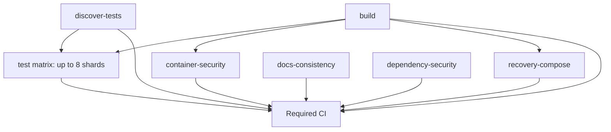

# GitHub Actions baseline for epic #560

This document records the initial read-only CI evidence required by #561 before changing execution policy. It is a point-in-time baseline, not a permanent performance guarantee.

## Scope and evidence rules

- Baseline date: 2026-09-10.
- Current `main` inspected before branching: `d469be2ebcf536919e2c090418156e3c910b9848`.
- Canonical workflow inspected: `.github/workflows/ci.yml`.
- Queue time, workflow wall time, job execution time and individual step time are kept separate.
- GitHub-hosted `ubuntu-latest` is the observed runner class. Monetary cost is intentionally not calculated because repository-specific billing/tariff data was not part of the audit evidence.
- Cold/warm cache classification is **not reliably exposed by the Actions jobs API used for this audit**. Where the cache state cannot be proven from logs, it is recorded as `unknown` rather than inferred.

## Representative runs

| Class | SHA | Event | Run | Runner | Shards | Workflow wall time | Cache state | Notes |
| --- | --- | --- | --- | --- | ---: | ---: | --- | --- |
| docs-only PR | `0e308daa59a3986431bf47e40968f7ab516cdef4` | `pull_request` | [CI 34452648845](https://github.com/askarahodov/freeipa-admin-dashboard-source/actions/runs/34452648845) | `ubuntu-latest` | 8 | about 2 min from first jobs at 07:58:10Z until the final aggregate after 08:00Z | unknown | PR #559 changed only three Markdown files, yet full CI, Docker image scanning, recovery Docker work and all Node shards still ran. |
| ordinary code PR | `8f43be138eff4b1b65a367bc013cda232d0b4801` | `pull_request` | [CI 34452719004](https://github.com/askarahodov/freeipa-admin-dashboard-source/actions/runs/34452719004) | `ubuntu-latest` | 8 | 124 s (`07:58:59Z` → `08:01:03Z`) | unknown | PR #545 changed recovery test discovery/runner code and correctly retained full current CI coverage. |
| push to main | `3fa3c06e7c4a482195b61f823b9b26ba570c4f9b` | `push` | [CI 34452098313](https://github.com/askarahodov/freeipa-admin-dashboard-source/actions/runs/34452098313) | `ubuntu-latest` | 8 | 131 s (`07:51:42Z` → `07:53:53Z`) | unknown | Post-merge main run; full regression must remain intentionally full in epic #560. |

A dependency/runtime-specific completed sample was not established from the small set inspected here. Do not create an artificial expensive PR only to fill that category; later #565/#566 measurements must add a real dependency/runtime sample when such a change exists.

### Related browser evidence

PR #559 also produced a completed Scoped E2E run, `34452648714`. The earlier audit sample `34451663571` reported an E2E job around 155 s, with the Chromium runner step around 143 s including Docker preparation. This is supporting evidence for the docs-only fast path; it is not merged into the `CI` runner-time totals below because it belongs to a separate workflow.

## Step-level sample: docs-only PR #559

The Actions jobs API for CI run `34452648845` exposes exact timestamps for the following representative steps:

| Job / step | Observed duration |
| --- | ---: |
| `build` job | 42 s |
| `build` → Set up Node.js | 7 s |
| `build` → `npm ci` | 9 s |
| `build` → lint | 11 s |
| `build` → build | 4 s |
| `build` → source snapshot creation + upload | about 1 s |
| `recovery-compose` job | 80 s |
| `recovery-compose` → `npm ci` | 11 s |
| `recovery-compose` → recovery contracts | <1 s at timestamp resolution |
| `recovery-compose` → isolated recovery Docker build | 45 s |
| `recovery-compose` → disposable named-volume smoke | 10 s |
| `dependency-security` job | 13 s |
| `docs-consistency` job | 10 s |
| `discover-tests` job | 9 s |

This sample demonstrates that queue/wrapper/setup overhead and Docker preparation dominate small changes more than the actual Node test execution. It must not be described as a stable benchmark from one run.

## Current CI DAG

### Dependency observations

- `test` genuinely requires `discover-tests` for the shard matrix and currently requires `build` because it downloads the `dist` artifact produced by `build`.
- `container-security` declares `needs: build` but performs its own checkout and its own `docker build --target runtime`; it does not download `dist` or `source-snapshot` in the current workflow.
- `recovery-compose` declares `needs: build` but performs its own checkout, `npm ci` and `docker build --target recovery`; it does not download `dist` or `source-snapshot` in the current workflow.
- `Required CI` fails closed unless every listed dependency reports `success`.

The ordering dependency of container/recovery on `build` is therefore confirmed; a direct artifact/data dependency from those jobs to `build` is not present in current `ci.yml`. Removing or changing that ordering is **out of scope for #561** and must be justified by later correctness/risk work.

## Artifact inventory

| Artifact | Producer | Confirmed in-workflow consumer | Retention |
| --- | --- | --- | ---: |
| `source-snapshot` | `build` | none found in current repository search/workflow | 1 day |
| `dist` | `build` | each `test` shard | 1 day |
| `server-shard-*-log` | each `test` shard | review/debug evidence only | 1 day |
| `runtime-image-security-scan` | `container-security` | review/security evidence | 14 days |
| `npm-production-sbom` | `dependency-security` when live audit is selected | review/security evidence | 14 days |

Repository code search found no `source-snapshot` reference outside the producer workflow. That proves no repository-local consumer was indexed/found at audit time; it does **not** prove the artifact has no external/manual consumer. Therefore #561 does not remove it.

## Repeated work inventory

Current `ci.yml` performs:

- `npm ci` once in `build`;
- `npm ci` once in `recovery-compose`;
- `npm ci` independently in every server test shard (up to 8 times);
- dependency setup separately in the dependency-security job through `setup-node`, while live audit/SBOM commands are conditional;
- one runtime Docker build in `container-security`;
- one recovery Docker build in `recovery-compose`.

At 8 shards, the normal CI topology can therefore execute **10 `npm ci` invocations** (`build` + `recovery-compose` + 8 test shards) before counting other workflows such as Scoped E2E.

## Baselines for later epic tasks

### #563 docs-only fast path

Observed docs-only behavior: the same heavy CI topology as code changes, including 8 Node shards and both Docker jobs. The #559 sample contains at least 42 s of build-job runner time and 80 s of recovery-job runner time even though no product/runtime file changed.

Initial acceptance target for #563, to be validated with comparable real PR runs:

- docs-only PR must execute no Docker build and no browser suite;
- `CI / Required CI` must still exist and fail closed on planner/docs-contract failure;
- docs-only CI wall time after jobs start should be **<= 45 s** on a comparable GitHub-hosted runner, or show a measured >= 60% reduction versus the pre-change docs-only sample if runner variance prevents the absolute threshold;
- total job execution proxy should decrease materially, with the before/after job list published alongside the run URLs.

The 45 s threshold is intentionally above the observed ~10 s docs-consistency job and allows setup/aggregate variance while remaining below the current build job alone plus downstream Docker critical path.

### #564 server test shard count

Current baseline is 8 deterministic shards. The parent audit observed individual shard jobs around 28–34 s while actual test execution was only about 2–7 s, showing that setup/`npm ci` dominates.

Acceptance target for 4/2-shard experiments:

- preserve exact once-only membership of all discovered server tests;
- preserve `--test-concurrency=1` inside each shard unless separately justified;
- choose the shard count that minimizes **job execution sum** without increasing CI wall time by more than 15% against the comparable 8-shard baseline;
- require at least two comparable successful measurements before adopting the new count.

### #565 Docker cache/reuse

Baseline Docker work is duplicated by boundary: runtime image build in `container-security` and recovery image build in `recovery-compose`. In the docs-only sample, the isolated recovery image build alone consumed 45 s.

Acceptance target:

- measure cold and warm runs explicitly from logs/cache metadata after cache changes are implemented;
- warm-cache Docker preparation should improve by >= 30% for the affected job without changing image contents/security scan semantics;
- a cold-cache run must remain correct and bounded; warm-cache success cannot be the only proof.

### #566/#567 security and risk routing

Current `dependency-security` runs deterministic policy validation on every CI run but performs live npm audit/SBOM only when dependency inputs changed. Current runtime-image scan and recovery container jobs run on every PR through `Required CI`.

Later changes must keep security coverage fail closed and add scheduled coverage where the risk can change without a repository diff. A skipped heavy job is acceptable only when the canonical plan explicitly marks it not required and the stable aggregate verifies that plan.

## Measurement protocol for before/after comparisons

For every optimization PR under #560 record:

1. base/head SHA and exact run URL;
2. event and diff class;
3. runner label;
4. queue delay (`created_at` → first relevant `started_at`) separately from workflow wall time;
5. workflow wall time;
6. sum of completed job execution windows as a runner-time proxy;
7. key setup/install/build/test/scan/artifact step durations;
8. cache state only when demonstrated by logs/metadata;
9. shard count and exact selected coverage plan;
10. limitations and known sources of variance.

Do not claim money saved without billing data, do not call queue time test time, and do not treat fewer jobs as success by itself.

## Coordination / ownership

- Owned path for #561: `docs/development/CI_BASELINE.md` only.
- Depends on: current main and read-only Actions evidence.
- Conflicts checked: open PRs inspected before branching; active PRs #534 and #568–#570 do not own this file or `.github/workflows/ci.yml`.
- No execution policy, required check name, product behavior, security assertion or workflow file is changed in #561.
- Rollback: revert this documentation-only commit.

## Handoff to epic #560

This baseline is the evidence link for #562–#567. The next execution-policy change must start with #562 (routing correctness/canonical plan), because the epic explicitly requires routing gaps to be fixed before docs-only or risk-based skipping is allowed.
